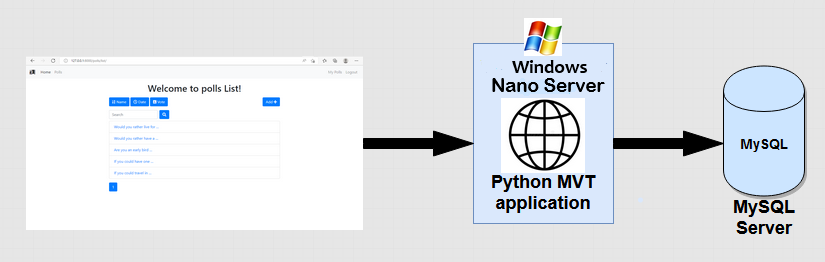

## PollApp - Modernizing Python web application with Nano server and Azure Cloud

This repository contains a sample of Django-poll web application and steps to modernize it using Windows Container(Nano-server) and Azure Cloud.

## Overview

Windows Container should be used as a way to improve deployments to production, development and test environment of existing Python applications based on different framework technologies and
deploying the Python application to the Azure Kubernetes Service.

## Goals

To containerize the Python-Django web application using Windows Container(Nano-server) and deploying it to Azure Kubernetes Service.

## Pre-requisites

- *Docker Desktop on Windows*, To create and build images of the application.
- *Azure CLI*, Azure Command-Line Interface (CLI) is a cross-platform command-line tool that can be used for windows to connect with the Azure portal and execute administrative commands on Azure resources.

## Implemented Azure Services & features

- Azure Container Registry (ACR)
- Azure Storage Account (file share)
- Azure Kubernetes Service (AKS)
- Azure monitoring (for logging and debugging purpose)
- Azure defender and security tool (for security purpose and scanning)
- Network Policy for CNI- Calico
- Cluster Auto Scaler
- Cluster Auto Upgrade
- Azure MySQL
- Azure key vaults (to store database secret)
- Azure CI/CD pipeline

## Architecture

Below figure shows the simple scenario of the original Python web application.



Below figure shows the containerized Django-PollApp web application and deployment to a Kubernetes cluster.


## Dockerfile for containerized Python web application

```dockerfile
FROM mcr.microsoft.com/windows-cssc/python3.7nanoserver:ltsc2019

RUN md C:\windows-containers-demos\django-poll-app\application
WORKDIR C:/windows-containers-demos/django-poll-app/application
COPY . C:/windows-containers-demos/django-poll-app/application

RUN python -m pip install --upgrade pip --user --no-warn-script-location
RUN pip install -r requirements.txt

RUN cmd python manage.py makemigrations

EXPOSE 8000

CMD ["python", "manage.py", "runserver", "0.0.0.0:8000"]
```

> As a workaround for AKS version 1.24.x, you can use the 'exec form' instead of the 'shell form' for your [Dockerfile cmd](https://docs.docker.com/engine/reference/builder/#cmd)

Here, we have used Microsoft's Nano server image with Python as a base image and installing requirements to build the application.

## Clone the repository

```powershell
git clone https://github.com/microsoft/windows-containers-demos  #Working directory is D:/
cd windows-containers-demos # Current working directory is D: \windows-containers-demos 
```

## Building Docker Image

```powershell
cd D:\windows-containers-demos\django-poll-app\application
docker build -t poll_app -f .\Dockerfile .
```

## Creating Azure Services

Initially, we need to create Azure Container Registry(ACR):

Open Powershell, login to Azure using the command *"az login"*.

We have created powershell scripts to create resources on Azure. Before running these script, we need to specify parameter values in [variables.txt](.\scripts\powershell-scripts\variables.txt) file.

ACR is used to store docker image of the application. Follow the below path to get the script:

_D:\windows-containers-demos\django-poll-app\scripts\powershell-scripts\create-acr.ps1_

Run above script using:

```powershell
.\create-acr.ps1
```

## Push the custom Docker image to ACR

```powershell
az acr login <acr-container-registry>
docker tag poll_app:latest <acr-container-registry>.azurecr.io/poll_app:latest
docker push <acr-container-registry>.azurecr.io/poll_app:latest
```

Now, enable Microsoft Defender for container registries from the portal which includes a vulnerability scanner to scan the images in Azure Container Registry registries and provide deeper visibility into your images vulnerabilities.

## Create file share

File Share stores the raw data of application. Follow the below path to get the script:

_D:\windows-containers-demos\django-poll-app\scripts\powershell-scripts\create-file-share.ps1_

Run above script using:

```powershell
.\create-file-share.ps1
```

## Create Azure AKS Cluster

Below script creates AKS and adds windows node pool that enables Cluster Autoscaling, Cluster Auto-Upgrade, Azure Monitor, Calico as a network Policy, Application Gateway to be used as the ingress of AKS cluster.

_D:\windows-containers-demos\django-poll-app\scripts\powershell-scripts\create-aks.ps1_

Run above script using:

```powershell
.\create-aks.ps1
```

> Be sure to pick a supported version within the region that you specify in your variables.txt.  For example, you can check the available AKS versions in your region with `az aks get-versions --location westus2`.

Connect with AKS to run kubectl commands for the new cluster.

```powershell
az aks get-credentials --resource-group=$aksResourceGroupName --name=$clusterName --admin
```

## Create Azure Key Vault

Cluster can access this key-vault secrets and certificate that contains connection string of MySQL server database.

```powershell
D:\windows-containers-demos\django-poll-app\scripts\powershell-scripts\create-key-vault.ps1
```

Assign access policy to AKS Cluster managed identity.

Login to Azure portal and perform the following steps:

- Click on Azure Key-Vault, go to Access Policies and click on Add Access policy.
- Select "Get" from the dropdown for secrets .
- Click on Select Principle and search for "<clustername>-agentpool" and click select
- Click on ADD button.
- Save the changes made.

Save database connection string in Azure Key Vault. Create database secret manually on the portal. Django poll-app needs connection strings like: *DBName, DBUser, DBPassword, DBHost and DBPort* of the database to be stored in key vault secrets, and these are referenced through the secret provider class for your AKS deployment.

## Create Azure MySQL database

```powershell
D:\windows-containers-demos\django-poll-app\scripts\powershell-scripts\create-mysql-server-database.ps1
```

Run above script using:

```powershell
.\create-mysql-server-database.ps1
```

Add the database connection string (`db-host`, `db-name`, `db-user`, `db-password`, and `db-port`) in system environment variables. Once added, restart the powershell as administrator and perform further steps.

Run the below commands to create the database table:

```powershell
python manage.py makemigrations
python manage.py migrate
```

To use admin panel you need to create the superuser using the following command:

```powershell
python manage.py createsuperuser
```

To run the application locally on container, execute the following command:

```powershell
docker run -d -p 4000:8000 --name <container_name> -e db-host="<host>" -e db-name="<databasename>" -e db-user="<username>" -e db-password="<password>" -e db-port="<database_port>" <acr-container-registry>.azurecr.io/<image_name:tag>
```

## Create Node Pool

Before moving forward to create the secrets, we need to create the node pool manually from Azure portal.
Steps to create the node pool are as follows:

1. Login to Azure portal
2. Search for Kubernetes services and go to Node pools
3. Add a new node pool with:
    - OS type: Windows
    - Node size: B2ms
    - Scale method: manual
    - Node count range: 3
4. Click Review+Create and then, Create.

Once the Node pool gets created successfully, proceed further with creating the secrets.

## Create Azure File Share Secrets

Kubernetes cluster will use this secret for mounting file share as volume in application deployment.

```powershell
D:\windows-containers-demos\django-poll-app\scripts\powershell-scripts\aks-file-share-secrets.ps1
```

Run above script using:

```powershell
.\aks-file-share-secrets.ps1
```

And check your secrets

```powershell
kubectl get secrets
```

## Install CSI Provider

We are installing CSI provider using helm chart. By default, CSI secret provider gets installed for linux nodes hence, we need to install it for windows node to enable windows parameters.

```powershell
D:\windows-containers-demos\django-poll-app\scripts\powershell-scripts\deploy-csi-akv-provider.ps1
```

Run above script using:

```powershell
.\deploy-csi-akv-provider.ps1
```

Check secret provider pods on Windows node:

```powershell
kubectl get pods
```

## Implementing Azure Pipelines

Azure Pipeline automatically builds and tests code projects to make them available to others. It works with just about any language or project type. Azure Pipelines combines continuous integration (CI) and continuous delivery (CD) to test and build your code and ship it to any target.

To use Azure Pipelines, you need:

- An organization in Azure DevOps
- To have your source code stored in a version control system.

## Building an Azure DevOps Build Pipeline

You can now create a build pipeline inside. It’s where you will create builds to perform various tasks like compiling code, bringing in dependencies and more.

- Linking a GitHub Repo to the Build Pipeline
- Using existing source code for building the pipeline
- Inspecting and Viewing the Build Pipeline in YAML
- Manually Running the Azure Build Pipeline

So here, we can check the azure-pipeline yaml:

```powershell
D:\windows-containers-demos\django-poll-app\application\azure-pipelines.yml                 
```

Finally we can check the pod and services by accessing the external IP

```powershell
kubectl get pods
kubectl get services
```


*You can inspect the container's file system and check the file share mounting secrets and key vault secrets.*
*You can also monitor cluster from azure portal*.
