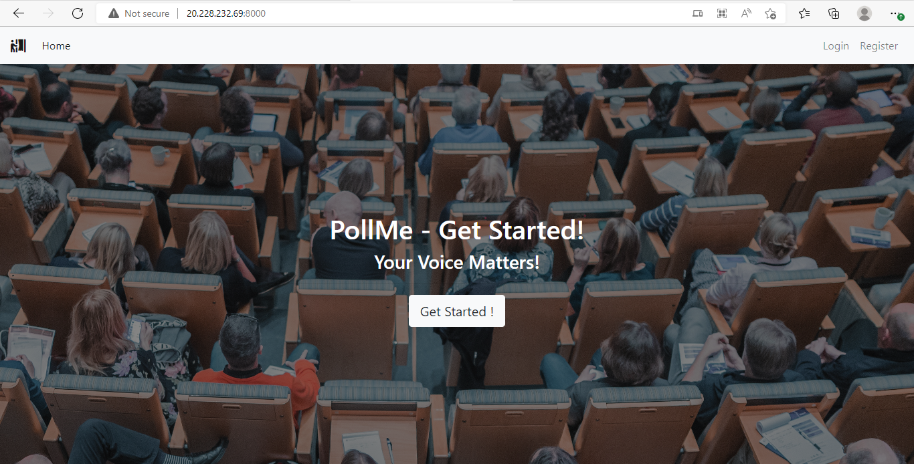

## PollApp - Modernizing Python web application with Nano server and Azure Cloud
This repository contains a sample of Django-poll web application and how to modernize it using Windows Container(Nano-server) and Azure Cloud.

## Overview
Windows Container should be used as a way to improve deployments to production, development, and test environments of existing Python applications based on different framework technologies and
deploying the Python application to the Azure Kubernetes Service.

## Goals
To containerize the Python-Django web application using Windows Container(Nano-server) and deploying it to Azure Kubernetes Service.

## Pre-requisites
- *Docker Desktop on Windows*, To create and build images of the application.
- *Azure CLI*, Azure Command-Line Interface (CLI) is a cross-platform command-line tool that can be used for windows to connect with the Azure portal and execute administrative commands on Azure resources.

## Implemented Azure Services & features
- Azure Container Registry (ACR)
- Azure Storage Account (file share)
- Azure Kubernetes Service (AKS)
- Azure monitoring (for logging and debugging purpose)
- Azure defender and security tool (for security purpose and scanning)
- Network Policy for CNI- Calico
- Cluster Auto Scaler
- Cluster Auto Upgrade
- Azure MySQL
- Azure key vaults (to store database secret)
- Azure CI/CD pipeline

## Architecture
Following figure shows the simple scenario of the original Python web application.


Following figure shows the containerized Django-PollApp web application and deployment to a Kubernetes cluster.


## Dockerfile for containerized Python web application
#### Note:
Currently, the [official Python image](https://hub.docker.com/_/python?tab=tags&page=1&name=windows) **does not support the Nano server directly**. 
It requires the Windows servercore base image, where we will first install the desired python into the servercore image, then we will create a new custom nanoserver image. Microsoft has a plan to work with the community to have Python images based on Nano Server container image developed. Once that's available, we'll update here.

To create custom nanoserver image for django application, we have used following Dockerfile

```
ARG WINDOWS_VERSION
FROM mcr.microsoft.com/windows/servercore:$WINDOWS_VERSION

ARG PYTHON_VERSION=3.7.4
ARG PYTHON_RELEASE=3.7.4
# if this is called "PIP_VERSION", pip explodes with "ValueError: invalid truth value '<VERSION>'"
ARG PYTHON_PIP_VERSION=20.0.2
# https://github.com/pypa/get-pip
ARG PYTHON_GET_PIP_URL=https://github.com/pypa/get-pip/raw/d59197a3c169cef378a22428a3fa99d33e080a5d/get-pip.py

USER ContainerAdministrator

WORKDIR C:\\Temp
SHELL ["powershell", "-Command", "$ErrorActionPreference = 'Stop'; $ProgressPreference = 'Continue'; $verbosePreference='Continue';"]

RUN [System.Net.ServicePointManager]::SecurityProtocol = [System.Net.SecurityProtocolType]::Tls12; \
    Invoke-WebRequest -UseBasicParsing -Uri "https://www.python.org/ftp/python/$env:PYTHON_RELEASE/python-$env:PYTHON_VERSION-embed-amd64.zip" -Out 'Python.zip'; \
    Expand-Archive -Path "Python.zip"; \
    Invoke-WebRequest -UseBasicParsing -Uri "$env:PYTHON_GET_PIP_URL" -OutFile 'Python\get-pip.py'; \
    [String]::Format('@set PYTHON_PIP_VERSION={0}', $env:PYTHON_PIP_VERSION) | Out-File -FilePath 'Python\pipver.cmd' -Encoding ASCII;

RUN $FileVer = [System.Version]::Parse([System.Diagnostics.FileVersionInfo]::GetVersionInfo('Python\python.exe').ProductVersion); \
    $Postfix = $FileVer.Major.ToString() + $FileVer.Minor.ToString(); \
    Remove-Item -Path "Python\python$Postfix._pth"; \
    Expand-Archive -Path "Python\python$Postfix.zip" -Destination "Python\Lib"; \
    Remove-Item -Path "Python\python$Postfix.zip"; \
    New-Item -Type Directory -Path "Python\DLLs";

FROM mcr.microsoft.com/windows/nanoserver:$WINDOWS_VERSION
COPY --from=0 C:\\Temp\\Python C:\\Python

USER ContainerAdministrator

ENV PYTHONPATH C:\\Python;C:\\Python\\Scripts;C:\\Python\\DLLs;C:\\Python\\Lib;C:\\Python\\Lib\\plat-win;C:\\Python\\Lib\\site-packages
RUN setx.exe /m PATH %PATH%;%PYTHONPATH% && \
    setx.exe /m PYTHONPATH %PYTHONPATH% && \
    setx.exe /m PIP_CACHE_DIR C:\Users\ContainerUser\AppData\Local\pip\Cache && \
    reg.exe ADD HKLM\SYSTEM\CurrentControlSet\Control\FileSystem /v LongPathsEnabled /t REG_DWORD /d 1 /f

# https://soooprmx.com/archives/6471
RUN assoc .py=Python.File && \
    assoc .pyc=Python.CompiledFile && \
    assoc .pyd=Python.Extension && \
    assoc .pyo=Python.CompiledFile && \
    assoc .pyw=Python.NoConFile && \
    assoc .pyz=Python.ArchiveFile && \
    assoc .pyzw=Python.NoConArchiveFile && \
    ftype Python.ArchiveFile="C:\Python\python.exe" "%1" %* && \
    ftype Python.CompiledFile="C:\Python\python.exe" "%1" %* && \
    ftype Python.File="C:\Python\python.exe" "%1" %* && \
    ftype Python.NoConArchiveFile="C:\Python\pythonw.exe" "%1" %* && \
    ftype Python.NoConFile="C:\Python\pythonw.exe" "%1" %*

RUN call C:\Python\pipver.cmd && \
    %COMSPEC% /s /c "echo Installing pip==%PYTHON_PIP_VERSION% ..." && \
    %COMSPEC% /s /c "C:\Python\python.exe C:\Python\get-pip.py --disable-pip-version-check --no-cache-dir pip==%PYTHON_PIP_VERSION%" && \
    echo Removing ... && \
    del /f /q C:\Python\get-pip.py C:\Python\pipver.cmd && \
    echo Verifying install ... && \
    echo   python --version && \
    python --version && \
    echo Verifying pip install ... && \
    echo   pip --version && \
    pip --version && \
    echo Complete.

RUN pip install virtualenv

USER ContainerUser

CMD ["python"]
```

Run following command to create custom nano-server image

```
docker build -t click2cloud/nanoserver:1.0 -f ./nanoserver.Dockerfile
```

Using above step, we will get base image for the django application and following Dockerfile willl be used to create image for the application
```
FROM click2cloud/nanoserver:1.0

RUN md C:\windows-containers-demos\django-poll-app\application
WORKDIR C:/windows-containers-demos/django-poll-app/application
COPY . C:/windows-containers-demos/django-poll-app/application

RUN python -m pip install --upgrade pip
RUN pip install -r requirements.txt
RUN cmd python manage.py makemigrations

EXPOSE 8000

CMD python manage.py runserver 0.0.0.0:8000
```
We are using Nano server base image and installing requirements to build the application.

## Clone the repository

```
git clone https://github.com/microsoft/windows-containers-demos  #Working directory is D:/
cd windows-containers-demos # Current working directory is D: \windows-containers-demos 
```

## Building Docker Image
```
cd D:\windows-containers-demos\django-poll-app
docker build -t poll_app -f .\Dockerfile .
```
## Creating Azure Services
First create Azure Container Registry(ACR).

Open Powershell , login to Azure using command "az login".

We have created powershell scripts to create resources on Azure. Before running these script, we need to specify paramters values in *variable.txt* file.

ACR is used for storing application docker image. Follow the below path to get the script:

_D:\windows-containers-demos\django-poll-app\scripts\powershell-scripts\create-acr.ps1_

Run above script using:

```
.\create-acr.ps1
```

## Push the custom Docker image into ACR

```
docker login <acr-container-registry>
docker tag poll_app:latest <acr-container-registry>/poll_app:latest
docker push <acr-container-registry>/poll_app:latest
```

## Create file share
File Share stores the raw data of application. Follow the below path to get the script:

_D:\windows-containers-demos\django-poll-app\scripts\powershell-scripts\create-file-share.ps1_

Run above script using:
```
.\create-file-share.ps1
```

## Create Azure AKS Cluster
Below script creates AKS and add window's node pool that enables Cluster Autoscaling, Cluster Auto-Upgrade, Azure Monitor, Calico as a network Policy, Application Gateway to be used as the ingress of AKS cluster.

_D:\windows-containers-demos\django-poll-app\scripts\powershell-scripts\create-aks.ps1_

Run above script using:
```
.\create-aks.ps1
```

Need to connect with AKS in order to run kubectl commands for the new cluster.

```
az aks get-credentials --resource-group=$aksResourceGroupName --name=$clusterName
```

## Create Azure MySQL database
```
D:\windows-containers-demos\django-poll-app\scripts\powershell-scripts\create-mysql-server-database.ps1
```
Run above script using:
```
.\create-mysql-server-database.ps1
```
Run the below commands in your project directory in order to create database table:
```
python manage.py makemigrations
python manage.py migrate
```
For running the application use below command: 
```
python manage.py runserver
```
To use admin panel you need to create superuser using this command:
```
 python manage.py createsuperuser 
```

## Install CSI Provider
We are installing CSI provider using helm chart, by default CSI secret provider install for linux nodes we have to install it for our window's node enable windows parameters.
```
D:\windows-containers-demos\django-poll-app\scripts\powershell-scripts\deploy-csi-akv-provider.ps1
```
Check secret provider pods on window's node:
```
kubectl get pods
```

## Create Azure Key Vault
Cluster can access this key-vault secrets and certificate, that contains connection string of MySQL server database.
```
D:\windows-containers-demos\django-poll-app\scripts\powershell-scripts\create-key-vault.ps1
```
Assign access policy for AKS Cluster managed identity.

Open the Azure portal and perform the following steps: -
- Click on Azure-Key-Vault, go to the Access Policies and click on Add Access policy.
- Select Get from dropdown for secrets .
- Select Get from dropdown for certificate permission.
- Then click on Select Principle and search for "<clustername>-agentpool" and then click on select
- Click on ADD button.
- At last, after adding policy click on save button.

Save database connection string in Azure Key Vault. Create database secret manually on portal.  Django poll-app application need connection strings of database.It stored the connection string into key vault secrets.

## Implementing Azure Pipelines
Azure Pipelines automatically builds and tests code projects to make them available to others. It works with just about any language or project type. Azure Pipelines combines continuous integration (CI) and continuous delivery (CD) to test and build your code and ship it to any target.

To use Azure Pipelines, you need:
- An organization in Azure DevOps.
- To have your source code stored in a version control system.
## Building an Azure DevOps Build Pipeline
You can now create a build pipeline inside. It’s where you will create builds to perform various tasks like compiling code, bringing in dependencies and more.
- Linking a GitHub Repo to the Build Pipeline
- Using existing source code for building the pipeline
- Inspecting and Viewing the Build Pipeline in YAML
- Manually Running the Azure Build Pipeline

So here, we can check the azure-pipeline yaml:
```
D:\windows-containers-demos\django-poll-app\application\azure-pipelines.yml                 
```
Finally we can check the pod and services by accessing the external IP
```
kubectl get pods
kubectl get services
```




*You can inspect the container's file system and check the file share mounting secrets and key vault secrets.*
*You can also monitor cluster from azure portal*.
