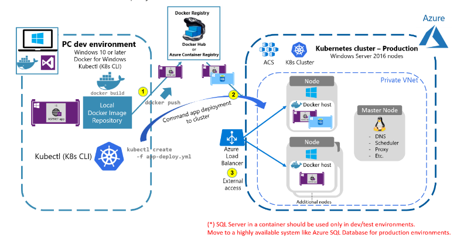

## eShopModernizing - Modernizing ASP.NET Web apps with Windows Containers and Azure Cloud
This repo provides sample of legacy eShop web apps and how you can modernize it with Windows Containers and Azure Cloud.

## Overview
Windows Containers should be used as a way to improve deployments to production, development, and test environments of existing .NET applications based on .NET Framework technologies and 
Deploying the ASP.NET MVC app (eShopModernizedMVC) to the Azure Kubernetes Service.

## Goals for this walkthrough
we are containerizing the .NET Framework web apps with Windows Containers and Docker without changing its code and then Deploying this Windows Containers-based app to Azure Kubernetes Service.

## Pre-requisite on Windows machine/VM
- *Docker Desktop on Windows*, For creating and building images of application.
- *Azure CLI*, Azure Command-Line Interface (CLI) is a cross-platform command-line tool. You can use the Azure CLI for Windows to connect to Azure and execute administrative commands on Azure resources. 

## Implemented Azure Services
- Azure Kubernetes Service (AKS)	
- Azure Container Registry (ACR)	
- Azure key vaults (database secret,StorageConnectionString)	
- Azure SQL
- Azure Storage Account (file share,blob storage)
- Azure monitoring (for logging and debugging purpose)
- Azure defender and security tool (for security purpose and scanning)	
- Network Policy for CNI- Calico
- Cluster Auto Scaler	
- Cluster Auto Upgrade

## Architecture
Figure below shows the simple scenario of the original legacy ASP.NET web application


Figure below shows the containerized eShop legacy web application and deployment to a Kubernetes cluster



## Containerizing existing .NET applications with Docker CLI and manually adding docker file 
This is the docker file

```
FROM mcr.microsoft.com/windows/servercore/iis:windowsservercore-ltsc2019  

# Install Chocolatey
RUN @powershell -NoProfile -ExecutionPolicy Bypass -Command "$env:ChocolateyUseWindowsCompression='false'; iex ((New-Object System.Net.WebClient).DownloadString('https://chocolatey.org/install.ps1'))" && SET "PATH=%PATH%;%ALLUSERSPROFILE%\chocolatey\bin"

# Copy files
RUN md c:\build
WORKDIR c:/build
COPY . c:/build

# Install build tools
RUN powershell add-windowsfeature web-asp-net45 \
    && choco install microsoft-build-tools -y --allow-empty-checksums -version 14.0.23107.10 \
    && choco install dotnet4.6-targetpack --allow-empty-checksums -y \
    && choco install nuget.commandline --allow-empty-checksums -y \
    && nuget install MSBuild.Microsoft.VisualStudio.Web.targets -Version 14.0.0.3 \
    && nuget install WebConfigTransformRunner -Version 1.0.0.1

RUN powershell remove-item C:\inetpub\wwwroot\iisstart.*

RUN xcopy c:\build\src\eShopModernizedMVC\* c:\inetpub\wwwroot /s

ENTRYPOINT ["powershell.exe", "./Startup.ps1"]
```
We are using Windows Server Core Image and Installing necessary tools for building our project.

Startup PowerShell script will create an infinite loop to run the container.
This prevents the container from exiting and getting web dot config location from second script Set-Web Config settings that read environment variables and overrides configuration in Web dot config by modifying the file.

## Building Docker Image
```
docker build -t eshopapp:v2.1  -f .\application\eshop.Dockerfile .
```

## Create Azure Services
Now, first create Azure Container Registry.

Open Powershell , login to Azure using command "az login".

```
C:\windows-containers\demo-apps\EshopMVCModernized-App\scripts\powershell-scripts\create-acr.ps1
```

## Publish/Push your custom Docker image into Azure Container Registry
Open PowerShell , Login to Azure Container Registry

```
docker login <acr-container-registry>
docker tag eshopapp:v2.1 <acr-container-registry>/eshopapp:v2.1
docker push <acr-container-registry>/eshopapp:v2.1
```

Now, Enable Microsoft Defender for container registries from the portal Which includes a vulnerability scanner to scan the images in Azure Container Registry registries and provide deeper visibility into your images vulnerabilities.

## Create file share and blob storage
File Share will store Applications Raw data and Blob storage will store Application's Images.

```
C:\windows-containers\demo-apps\EshopMVCModernized-App\scripts\powershell-scripts\create-file-share.ps1
```
*Implementing blob storage from code side*

## Create Azure AKS Cluster
This script will create AKS and add a window's node pool which enables Cluster Autoscaling, Cluster Auto-Upgrade, Azure Monitor, Calico as a network Policy, Application Gateway to be used as the ingress of an AKS cluster.
```
C:\windows-containers\demo-apps\EshopMVCModernized-App\scripts\powershell-scripts\create-aks.ps1
```
It will ask for device login enter code.
Now Connect to AKS cluster as admin using command on connect on Portal

```
az aks get-credentials --resource-group=$aksResourceGroupName --name=$clusterName --admin 
```

 You can access nodes, pods etc.

## Create Azure SQL database
```
C:\windows-containers\demo-apps\EshopMVCModernized-App\scripts\powershell-scripts\create-sql-server-database.ps1
```

First need to update database connection string in web.config file from Visual Studio IDE for performing Database Migration steps.


Next Query the database, using SSMS or Azure Sql databases Query Editor.

Using SSMS Enter your server admin login.
You will get connected to Azure SQL database.
 Run the following SQL scripts on SQL query editor.
```
C:\windows-containers\demo-apps\EshopMVCModernized-App\scripts\database-scripts
dbo.catalog_brand_hilo.Sequence.sql
dbo.catalog_hilo.Sequence.sql
dbo.catalog_type_hilo.Sequence.sql
```
Then Open Visual Studio IDE ,on Package Manager Console perform database Migration.
Run 
```
Enable-Migrations -Force
Add-Migration InitialCreate 
update-database -Verbose
```
Again Back to SSMS . Run insert database SQL Query,
```
insertdata.sql
```
## Create Azure Key Vault 
Cluster can access this key-vault secrets, save secrets in key vault, secrets containing connection string of SQL Server database and storage account connection string.
```
C:\windows-containers\demo-apps\EshopMVCModernized-App\scripts\powershell-scripts\create-key-vault.ps1
```
Assign access policy for AKS Cluster managed identity.

open an azure portal and perform the following steps: -
- Click on Azure-Key-Vault, go to the Access Policies and click on Add Access policy 
- Select Get from dropdown for secrets
- Then click on Select Principle and search for cluster name, agent pool and then click on select
- click on ADD button 
- At last, after adding policy click on save button. 

Now Create database secret, and storage connection secret using CLI or manually on portal.

On Powershell
```
$keyVaultName = "<Azure-Key-Vault-Name>"
$secret1Name = "CatalogDBContext"
$secret2Name = "StorageConnectionString"
az keyvault secret set --name $secret1Name --value "DataSource=<sql-server-database-connection-string>" –-vault-name $keyVaultName
az keyvault secret set --name $secret2Name --value "DataSource=<storage-account-connection-string>" –-vault-name $keyVaultName
```

## Create Azure File Share Secrets
kubernetes cluster will use this  secret and storage account key that should be used with file share mounting while pod deployment.
```
C:\windows-containers\demo-apps\EshopMVCModernized-App\scripts\powershell-scripts\aks-file-share-secrets.ps1
```
check Secrets
```
kubectl get secrets
```

## Install CSI Provider
We are installing CSI provider using helm chart, by default CSI secret provider install for linux nodes we have to install it for our window's node enable windows parameters.
```
C:\windows-containers\demo-apps\EshopMVCModernized-App\scripts\powershell-scripts\deploy-csi-akv-provider.ps1
```
Check secret provider pods on window's node
```
kubectl get pods
```

## Deploy Application on AKS 

Apply Manifest files
- persistent-volume
- persistent-volume-claim
- secret-provider-class
- eshop-deployment

```
cd  C:\windows-containers\demo-apps\EshopMVCModernized-App\scripts\deployment-scripts\app-deployment-mainfest-files 
kubectl apply -f .
```
```
kubectl get pods
```

for Azure file Share, we are creating persistent-volume and persistent-volume-claim.

for Azure key Vault we are using SecretProviderClass in which specifying secretObjects.

For pod deployment specifying replica sets, environment variable taking value from SecretProviderClass secrets, then mount azure file share to container using persistentVolumeClaim. And mounting SecretProviderClass for key-vault.

and using load balancer service for accessing deployment.


Check the pod and services by accessing the service external IP 
```
kubectl get pods
kubectl get services
```


*You can inspect the container's file system and check the file share mounting secrets and key vault secrets.*
*we can check blob storage in storage account inside container where pics container is created where application images are stored.*
