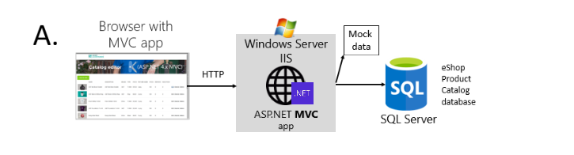

## eShopModernizing - Modernizing ASP.NET Web apps with Windows Containers and Azure Cloud

This repo provides sample of legacy eShop web apps and how you can modernize it with Windows Containers and Azure Cloud.

## Overview

Windows Containers should be used as a way to improve deployments to production, development, and test environments of existing .NET applications based on .NET Framework technologies and
Deploying the ASP.NET MVC app (eShopModernizedMVC) to the Azure Kubernetes Service.

## Goals for this walkthrough

we are containerizing the .NET Framework web apps with Windows Containers and Docker without changing its code and then Deploying this Windows Containers-based app to Azure Kubernetes Service.

## Pre-requisite on Windows machine/VM

- *Docker Desktop on Windows*, For creating and building images of application.
- *Azure CLI*, Azure Command-Line Interface (CLI) is a cross-platform command-line tool. You can use the Azure CLI for Windows to connect to Azure and execute administrative commands on Azure resources.

## Implemented Azure Services

- Azure Kubernetes Service (AKS)
- Azure Container Registry (ACR)
- Azure key vaults (database secret,StorageConnectionString)
- Azure SQL
- Azure Storage Account (file share,blob storage)
- Azure monitoring (for logging and debugging purpose)
- Azure defender and security tool (for security purpose and scanning)
- Network Policy for CNI- Calico
- gMSA on Azure Kubernetes Service
- Cluster Auto Scaler
- Cluster Auto Upgrade

## Architecture

Figure below shows the simple scenario of the original legacy ASP.NET web application



Figure below shows the containerized eShop legacy web application and deployment to a Kubernetes cluster


## Containerizing existing .NET applications with Docker CLI and manually adding docker file

This is the docker file

```dockerfile
FROM mcr.microsoft.com/windows/servercore/iis:windowsservercore-ltsc2019

# Install Chocolatey
RUN @powershell -NoProfile -ExecutionPolicy Bypass -Command "$env:ChocolateyUseWindowsCompression='false'; iex ((New-Object System.Net.WebClient).DownloadString('https://chocolatey.org/install.ps1'))" && SET "PATH=%PATH%;%ALLUSERSPROFILE%\chocolatey\bin"

# Install build tools
RUN powershell add-windowsfeature web-asp-net45 \
    && choco install microsoft-build-tools -y --allow-empty-checksums -version 14.0.23107.10 \
    && choco install dotnet4.6-targetpack --allow-empty-checksums -y \
    && choco install nuget.commandline --allow-empty-checksums -y \
    && nuget install MSBuild.Microsoft.VisualStudio.Web.targets -Version 14.0.0.3 \
    && nuget install WebConfigTransformRunner -Version 1.0.0.1

# Install LogMonitor.exe
RUN powershell New-Item -ItemType Directory C:\LogMonitor; $downloads = @(@{ uri = 'https://github.com/microsoft/windows-container-tools/releases/download/v1.2/LogMonitor.exe'; outFile = 'C:\LogMonitor\LogMonitor.exe' }, @{ uri = 'https://raw.githubusercontent.com/microsoft/windows-container-tools/main/LogMonitor/src/LogMonitor/sample-config-files/IIS/LogMonitorConfig.json'; outFile = 'C:\LogMonitor\LogMonitorConfig.json' } ); $downloads.ForEach({ Invoke-WebRequest -UseBasicParsing -Uri $psitem.uri -OutFile $psitem.outFile })

# Copy files
RUN md c:\build
WORKDIR c:/build
COPY . c:/build

RUN powershell remove-item C:\inetpub\wwwroot\iisstart.*
RUN xcopy c:\build\src\eShopModernizedMVC\* c:\inetpub\wwwroot /s

# Enable ETW logging for Default Web Site on IIS
RUN c:\windows\system32\inetsrv\appcmd.exe set config -section:system.applicationHost/sites /"[name='Default Web Site'].logFile.logTargetW3C:"File,ETW"" /commit:apphost

# Start "C:\LogMonitor\LogMonitor.exe and application"
SHELL ["C:/LogMonitor/LogMonitor.exe", "powershell.exe"]
ENTRYPOINT ["powershell.exe", "./Startup.ps1"]
```

We are using Windows Server Core Image and Installing necessary tools for building our project.

Startup PowerShell script will create an infinite loop to run the container.
This prevents the container from exiting and getting web dot config location from second script Set-Web Config settings that read environment variables and overrides configuration in Web dot config by modifying the file.

Also implementing IIS Log Monitor for ASP.NET Windows Containers.

## Clone the repository

```powershell
git clone https://github.com/microsoft/windows-containers-demos  #Working directory is D:/
cd windows-containers-demos # Current working directory is D:\windows-containers-demos 
```

## Building Docker Image

```powershell
cd D:\windows-containers-demos\eshop-mvc-modernized-app\application
docker build -t eshopapp:v2.1  -f .\eshop.Dockerfile .
```

## Populate variables.txt 
We have created powershell scripts to create resources on Azure. Before running these script, we need to specify parameter values in variables.txt file.
Using a text editor of choice open the variables.txt file and provide appropriate values for the items in the <>.

```code
D:\windows-containers-demos\eshop-mvc-modernized-app\scripts\powershell-scripts\variables.txt
```
Example
```
# Copyright (c) Microsoft Corporation.
# Licensed under the MIT license.
subscriptionName="12366897-1234-abcd-abcd-1d5eav12a628"
resourceGroupName="eshopdemotestrg"
resourceGroupLocation="westus3"
# CONTAINER REGISTERY DETAILS
acrRegistryName="eshopdemotest"
# STORAGE ACCOUNT FILE SHARE DETAILS
aksStorageAccountname="eshopdemotest"
aksFileSharename="eshopshare"
aksStorageAccountSKU="Premium_LRS"
# AZURE KEY VAULT DETAILS
akvName="eshopdemotest"
# AZURE CLUSTER DETAILS
clusterName="eshopdemotest"
workerNodeCount="3"
networkPlugin="azure"
loadBalancerSKU="standard"
nodeVMSize="Standard_D2_v3"
winNodePoolName="ewin"
winNodeVMSize="Standard_D4_v3"
winWorkerNodeCount="3"
enableAutoScaler=True
nodeMinCount=2
nodeMaxCount=4
enableMonitoring=True
sqlServerName="eshopdemotest"
sqlServerAdminUser="eshopsqladmin"
sqlServerAdminUserPassword="pAssw0rdSc<l"
sqlDatabaseName="eshop"
```


## Create Azure Services

Now, first create Azure Container Registry.

Open Powershell , login to Azure using command "az login".

```powershell
D:\windows-containers-demos\eshop-mvc-modernized-app\scripts\powershell-scripts\create-acr.ps1
```

## Publish/Push your custom Docker image into Azure Container Registry

Open PowerShell , Login to Azure Container Registry.

```powershell
az acr login --name <acr-container-registry>
docker tag eshopapp:v2.1 <acr-container-registry>/eshopapp:v2.1
docker push <acr-container-registry>/eshopapp:v2.1
```

Now, Enable Microsoft Defender for container registries from the portal Which includes a vulnerability scanner to scan the images in Azure Container Registry registries and provide deeper visibility into your images vulnerabilities.

## Create file share and blob storage

File Share will store Applications Raw data and Blob storage will store Application's Images.

```powershell
D:\windows-containers-demos\eshop-mvc-modernized-app\scripts\powershell-scripts\create-file-share.ps1
```

*Implementing blob storage from code side*

## Create Azure AKS Cluster

This script will create AKS and add a window's node pool which enables Cluster Autoscaling, Cluster Auto-Upgrade, Azure Monitor, Calico as a network Policy, Application Gateway to be used as the ingress of an AKS cluster.

```powershell
D:\windows-containers-demos\eshop-mvc-modernized-app\scripts\powershell-scripts\create-aks.ps1
```

It will ask for device login enter code.
Now Connect to AKS cluster as admin using command on connect on Portal

```powershell
az aks get-credentials --resource-group=$aksResourceGroupName --name=$clusterName --admin 
```

You can access nodes, pods etc.

## Create Azure SQL database

```powershell
D:\windows-containers-demos\eshop-mvc-modernized-app\scripts\powershell-scripts\create-sql-server-database.ps1
```

First we need to update database connection string in web.config file from Visual Studio IDE for performing Database Migration steps, this must be done in Visual Studio 2019 (it will fail in Visual Studio 2022).

Next Query the database, use SSMS or Azure Sql databases Query Editor.

Using SSMS/Azure Query Editor Enter your server admin login.
You will get connected to Azure SQL database.
Run the following SQL scripts on SQL query editor. 

 **_NOTE:_** You will need to update the USE statments to match the name of your SQL DB. 
For example:
USE [Microsoft.eShopOnContainers.Services.CatalogDb] to USE [eshop]

```powershell
D:\windows-containers-demos\eshop-mvc-modernized-app\scripts\database-scripts
dbo.catalog_brand_hilo.Sequence.sql
dbo.catalog_hilo.Sequence.sql
dbo.catalog_type_hilo.Sequence.sql
```

Then Again Open Visual Studio IDE , Go to Package Manager Console perform database Migration steps.
Run following commands:

```powershell
Enable-Migrations -Force
Add-Migration InitialCreate 
update-database -Verbose
```

Again Back to SSMS/Azure Query Editor. Run insert Query,

```
insertdata.sql
```

## Create Azure Key Vault

Cluster can access this key-vault secrets and certificate, save secrets and certificate in key vault, secrets containing connection string of SQL Server database and storage account connection string. Also, assigns the access policy for AKS Cluster managed identity.

```powershell
D:\windows-containers-demos\eshop-mvc-modernized-app\scripts\powershell-scripts\create-key-vault.ps1
```

## Create Azure File Share Secrets

kubernetes cluster will use this  secret and storage account key that should be used with file share mounting while pod deployment.

```powershell
D:\windows-containers-demos\eshop-mvc-modernized-app\scripts\powershell-scripts\aks-file-share-secrets.ps1
```

Check Secrets using the following command:

```powershell
kubectl get secrets
```

## Install CSI Provider

We are installing CSI provider using helm chart, by default CSI secret provider install for linux nodes we have to install it for our window's node for that enable windows parameters.

```powershell
D:\windows-containers-demos\eshop-mvc-modernized-app\scripts\powershell-scripts\deploy-csi-akv-provider.ps1
```

Check secret provider pods on window's node

```powershell
kubectl get pods
```

## Deploy Application on AKS with gMSA

Before deployment, enable gMSA on Azure Kubernetes Service using the [guidance](https://docs.microsoft.com/en-us/virtualization/windowscontainers/manage-containers/gmsa-aks-ps-module)

Apply Manifest files

- persistent-volume
- persistent-volume-claim
- secret-provider-class
- eshop-deployment

```powershell
cd  D:\windows-containers-demos\eshop-mvc-modernized-app\scripts\deployment-scripts\app-deployment-manifest-files
kubectl apply -f .
```

```powershell
kubectl get pods
```

for Azure file Share, we are creating persistent-volume and persistent-volume-claim.

for Azure key Vault we are using SecretProviderClass in which specifying secretObjects.

For pod deployment specifying replica sets, set GMSA credential spec name for Pods and containers that will run on Windows nodes, environment variable taking value from SecretProviderClass secrets, then mount azure file share to container using persistentVolumeClaim. And mounting SecretProviderClass for key-vault.

and using load balancer service for accessing deployment.

Check the pod and services by accessing the service external IP

```powershell
kubectl get pods
kubectl get services
```

It will give the windows authentication prompt for credentials ,Enter gMSA user credentials and next you can access the Application.


*You can inspect the container's file system and check the file share mounting secrets and key vault secrets.*
*we can check blob storage in storage account inside container where pics container is created where application images are stored.*
