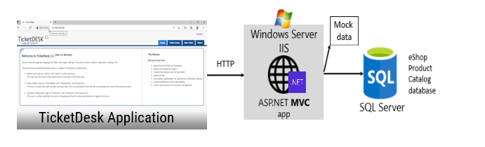
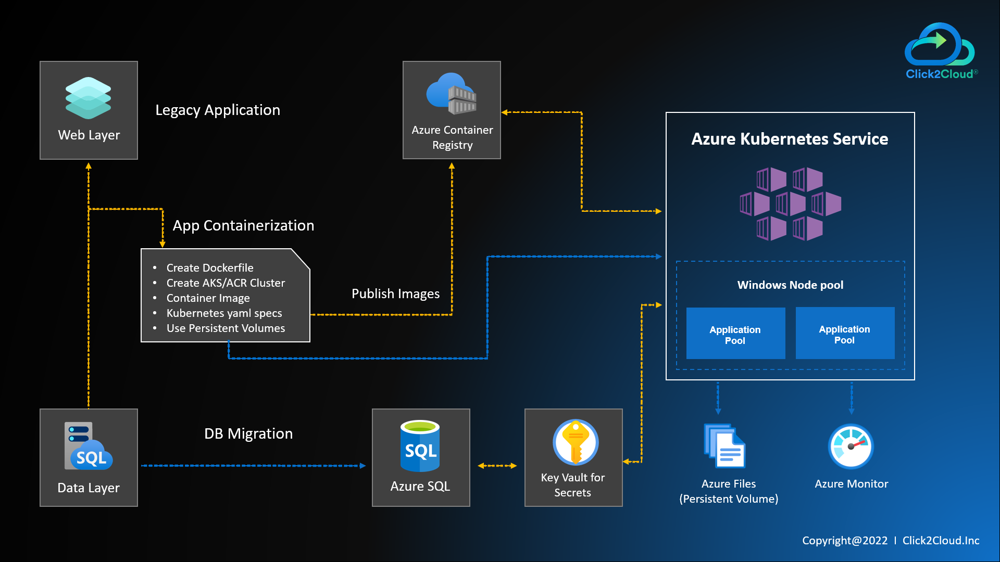
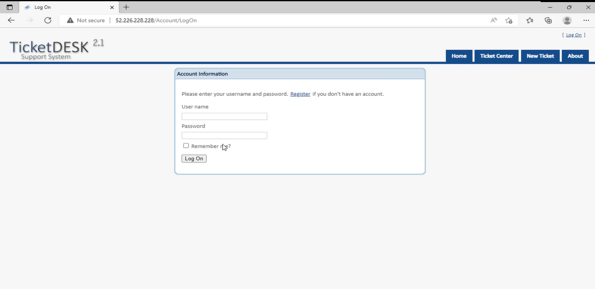

## TicketDESK - Modernizing ASP.NET Web apps with Windows Containers and Azure Cloud
This repo provides sample of legacy TicketDESK WebAapp and how you can modernize it with Windows Containers and Azure Cloud.

## Overview
Windows Containers should be used as a way to improve deployments to production, development, and test environments of existing .NET applications based on .NET Framework technologies and 
Deploying the ASP.NET MVC app (TicketDESK) to the Azure Kubernetes Service.

## Goals for this walkthrough
We are containerizing the .NET Framework WebApps with Windows Containers and Docker without changing its code and then Deploying this Windows Containers-based app to Azure Kubernetes Service.

## Pre-requisite on Windows machine/VM
- *Docker Desktop on Windows*, For creating and building images of application.
- *Azure CLI*, Azure Command-Line Interface (CLI) is a cross-platform command-line tool. You can use the Azure CLI for Windows to connect to Azure and execute administrative commands on Azure resources. 

## Implemented Azure Services
- Azure Kubernetes Service (AKS)	
- Azure Container Registry (ACR)	
- Azure key vaults (database secret,StorageConnectionString)	
- Azure SQL
- Azure Storage Account (file share,blob storage)
- Azure monitoring (for logging and debugging purpose)
- Azure defender and security tool (for security purpose and scanning)	
- Network Policy for CNI- Calico 
- Azure Active Directory (AAD)	
- Cluster Auto Scaler	
- Cluster Auto Upgrade

## Architecture
Figure below shows the simple scenario of the original legacy ASP.NET web application



Figure below shows the containerized TicketDesk legacy web application and deployment to a Kubernetes cluster



## Containerizing existing .NET applications with Docker CLI and manually adding docker file 
For ticket-desk-help app, following Dockerfile will be used

```
FROM mcr.microsoft.com/windows/servercore/iis:windowsservercore-ltsc2019

# Install Chocolatey
RUN @powershell -NoProfile -ExecutionPolicy Bypass -Command "$env:ChocolateyUseWindowsCompression='false'; iex ((New-Object System.Net.WebClient).DownloadString('https://chocolatey.org/install.ps1'))" && SET "PATH=%PATH%;%ALLUSERSPROFILE%\chocolatey\bin"

# Install build tools
RUN powershell add-windowsfeature web-asp-net45 \
    && choco install microsoft-build-tools -y --allow-empty-checksums -version 14.0.23107.10 \
    && choco install dotnet4.6-targetpack --allow-empty-checksums -y \
    && choco install nuget.commandline --allow-empty-checksums -y \
    && nuget install MSBuild.Microsoft.VisualStudio.Web.targets -Version 14.0.0.3 \
    && nuget install WebConfigTransformRunner -Version 1.0.0.1

RUN powershell remove-item C:\inetpub\wwwroot\iisstart.*

# Copy files
RUN md c:\build
WORKDIR c:/build
COPY . c:/build

# Restore packages, build, copy
RUN nuget restore 
RUN C:\Windows\Microsoft.NET\Framework64\v4.0.30319\MSBuild.exe /p:Platform="Any CPU" /p:VisualStudioVersion=12.0 /p:VSToolsPath=c:\MSBuild.Microsoft.VisualStudio.Web.targets.14.0.0.3\tools\VSToolsPath TicketDesk2.sln
RUN xcopy c:\build\TicketDesk.Web.Client\* c:\inetpub\wwwroot /s

#RUN powershell .\add_certificate_IIS

ENTRYPOINT powershell .\Startup


```
We are using Windows Server Core Image and installing necessary tools for building our project.

Startup PowerShell script will create an infinite loop to run the container.
This prevents the container from exiting and getting web dot config location from second script Set-Web Config settings that read environment variables and over-rides configuration in web.config by modifying the file.

## Clone the repository

```json
git clone https://github.com/microsoft/windows-containers-demos #Working directory is D:/
cd windows-containers-demos
```
## Startup.ps1

```
.\Set-WebConfigSettings.ps1 -webConfig c:\inetpub\wwwroot\Web.config
#.\add_certificate_IIS.ps1
#C:\ServiceMonitor.exe w3svc

If (Test-Path Env:\ASPNET_ENVIRONMENT)
{
    \WebConfigTransformRunner.1.0.0.1\Tools\WebConfigTransformRunner.exe \inetpub\wwwroot\Web.config "\inetpub\wwwroot\Web.$env:ASPNET_ENVIRONMENT.config" \inetpub\wwwroot\Web.config
}
Write-Host "IIS Started..."
while ($true) { Start-Sleep -Seconds 3600 }
```

Then by using Startup powershell script it is creating an infinite loop to run the container. This prevents the container from exiting .

## Set-WebConfigSettings.ps1

```
param (
    [string]$webConfig = "c:\inetpub\wwwroot\Web.config"
)

$doc = (Get-Content $webConfig) -as [Xml];
$modified = $FALSE;

$appSettingPrefix = "APPSETTING_";
$connectionStringPrefix = "CONNSTR_";

Get-ChildItem env:* | ForEach-Object {
    if ($_.Key.StartsWith($appSettingPrefix)) {
        $key = $_.Key.Substring($appSettingPrefix.Length);
        $appSetting = $doc.configuration.appSettings.add | Where-Object {$_.key -eq $key};
        if ($appSetting) {
            $appSetting.value = $_.Value;
            Write-Host "Replaced appSetting" $_.Key $_.Value;
            $modified = $TRUE;
        }
    }
    if ($_.Key.StartsWith($connectionStringPrefix)) {
        $key = $_.Key.Substring($connectionStringPrefix.Length);
        $connStr = $doc.configuration.connectionStrings.add | Where-Object {$_.name -eq $key};
        if ($connStr) {
            $connStr.connectionString = $_.Value;
            Write-Host "Replaced connectionString" $_.Key $_.Value;
            $modified = $TRUE;
        }
    }
}

if ($modified) {
    $doc.Save($webConfig);
}
```

Passing web.config file location to this second script Set-WebConfigSettings that reads environment variables and over-rides configuration in Web.config by modifying the file. 

## Building Docker Image
```
cd D:\windows-containers-demos\ticket-desk\application
docker build -t ticketdesk:latest  -f .\ticketDesk.Dockerfile .
```

Our Image is created 

## Create Azure Services
Now, first create Azure Container Registry.

Open Powershell , login to Azure using command "az login".

#### So we have created powershell script to create resources on Azure. Before running powershell script first we have to provide paramters value in *variable.txt* file.


The first service we are going to create is Azure Container Registry (ACR). It is used for storing application docker image, so ,  for creating ACR run following script


```
D:\windows-containers-demos\ticket-desk\scripts\powershell-scripts\create-acr.ps1
```

## Publish/Push your custom Docker image into Azure Container Registry
Open PowerShell , Login to Azure Container Registry

```
docker login <acr-container-registry>
docker tag ticketdesk:latest <acr-container-registry>/ticketdesk:latest
docker push <acr-container-registry>/ticketdesk:latest
```

Now, enable Microsoft Defender for container registries from the portal which includes a vulnerability scanner to scan the images in Azure Container Registry registries and provide deeper visibility into your images vulnerabilities.

## Create file share and blob storage
File Share will store Application's Raw data and Blob storage will store Application's Images.

```
D:\windows-containers-demos\ticket-desk\scripts\powershell-scripts\create-file-share.ps1
```

## Implementing Azure Active Directory Applications
For integrating AAD with Azure Kubernetes Service, we need to create a server and client app, which will be used to authenticate the users connecting to AKS through AAD.
This is the authentication part. 
For the authorization part, it will be managed by Role and Role Binding Kubernetes objects which is further explained.
```
D:\windows-containers-demos\ticket-desk\scripts\powershell-scripts\create-ad-apps.ps1
```

After creation of AAD apllications you will see the _Server App ID_, _Server App Secret_, _Client App ID_ on powershell console, you have to update these values in _Variables.txt_ file before creating Kubernetes Cluster

## Create Azure AKS Cluster
This script will create AKS and add a window's node pool which enables Cluster Autoscaling, Cluster Auto-Upgrade, Azure Monitor, Calico as a network Policy, Application Gateway to be used as the ingress of an AKS cluster.
```
D:\windows-containers-demos\ticket-desk\scripts\powershell-scripts\create-aks.ps1
```

We need to connect to AKS in order to run kubectl commands against the new cluster, as an admin.

```
az aks get-credentials --resource-group=$aksResourceGroupName --name=$clusterName --admin 
```

then let’s create the Role which will define access to certain resources. For example, only read information from pods.
Apply role ,role binding for accessing cluster which is Authorization part for AAD , update _Name_ parameter value in yaml files before applying
```
cd D:\windows-containers-demos\ticket-desk\scripts\deployment-scripts\role-binding-mainfest-files
kubectl apply -f .
```
then You can access nodes, pods etc.

## Create Azure SQL database
```
D:\windows-containers-demos\ticket-desk\scripts\powershell-scripts\create-sql-server-database.ps1
```
Next Query the database, using SSMS, enter your server login.
You will get connected to Azure SQL database.
 Run the SQL script on sql query editor.
```
D:\windows-containers-demos\ticket-desk\application\TicketDesk.Web.Client\App_Data\NewDatabaseScripts
1_TicketDeskObjects.sql
2_SecurityObjects.sql
3_SecurityDefaultUsers.sql
```

## Create Azure Key Vault 
Cluster can access this key-vault secrets and certificate, save secrets and certificate in key vault, secrets containing connection string of SQL Server database.
```
D:\windows-containers-demos\ticket-desk\scripts\powershell-scripts\create-key-vault.ps1
```
Assign access policy for AKS Cluster managed identity.

Open the Azure portal and perform the following steps: -
- Click on Azure-Key-Vault, go to the Access Policies and click on Add Access policy. 
- Select Get from dropdown for secrets .
- Select Get from dropdown for certificate permission.
- Then click on Select Principle and search for "<clustername>-agentpool" and then click on select
- Click on ADD button. 
- At last, after adding policy click on save button. 

Now Save database connection string in Azure Key Vault. Create database secret using CLI or manually on portal. So,here ,  ticketdESK application need 3 connection strings of database.So, store 3 connection strings into key vault secret, such as-

On Powershell
```
$keyVaultName = "<Azure-Key-Vault-Name>"
$secret1Name = "TicketDeskSecurityConnectionString"
$secret2Name = "TicketDeskEntities"
$secret3Name = "ElmahLog"

az keyvault secret set --name $secret1Name --value "Data Source=<your sql server host>;Initial Catalog=<your database name>;UserId=<your sql server username>;Password=<Your SQl server password>" –-vault-name $keyVaultName

az keyvault secret set --name $secret2Name --value "metadata=res://*/Models.TicketDeskEntities.csdl|res://*/Models.TicketDeskEntities.ssdl|res://*/Models.TicketDeskEntities.msl;provider=System.Data.SqlClient;provider connection string='Data Source=<your sql server host>;Initial Catalog=<your database name>;UserId=<your sql server username>;Password=<Your SQl server password>'" –-vault-name $keyVaultName 

az keyvault secret set --name $secret3Name --value "Data Source=<your sql server host>;Initial Catalog=<your database name>;UserId=<your sql server username>;Password=<Your SQl server password>" –-vault-name $keyVaultName
```

## Create Azure File Share Secrets
kubernetes cluster will use this secret for mounting file share as volume in application deployment.
```
D:\windows-containers-demos\ticket-desk\scripts\powershell-scripts\aks-file-share-secrets.ps1
```
check Secrets
```
kubectl get secrets
```

## Install CSI Provider
We are installing CSI provider using helm chart. By default CSI secret provider is installed for linux nodes.We have to install it for our window's node & enable windows parameters.
```
D:\windows-containers-demos\ticket-desk\scripts\powershell-scripts\deploy-csi-akv-provider.ps1
```
Check secret provider pods on window's node.
```
kubectl get pods
```

## Deploy Application on AKS
Now we are ready to deploy application on AKS Cluster.
Apply Manifest files
- persistent-volume
- persistent-volume-claim
- secret-provider-class
- ticket-desk-deployment

```
cd  D:\windows-containers-demos\ticket-desk\scripts\deployment-scripts\app-deployment-mainfest-files 
kubectl apply -f .
```
```
kubectl get pods
```

For Azure file Share, we are creating persistent-volume and persistent-volume-claim.

For Azure key Vault we are using SecretProviderClass in which we are specifying secret Objects.

For pod deployment we are specifying replica sets, environment variable taking value from SecretProviderClass secrets, then we mount azure file share to container using persistentVolumeClaim. And then mount SecretProviderClass for key-vault.

Then use load balancer service for accessing deployment.


Check the pod and services by accessing the service external IP
```
kubectl get pods
kubectl get services
```




*You can inspect the container's file system and check the file share mounting secrets and key vault secrets.*
*You can also monitor cluster from azure portal*
